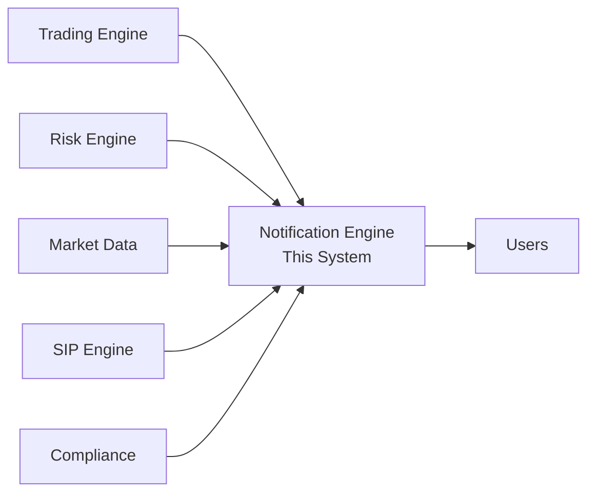
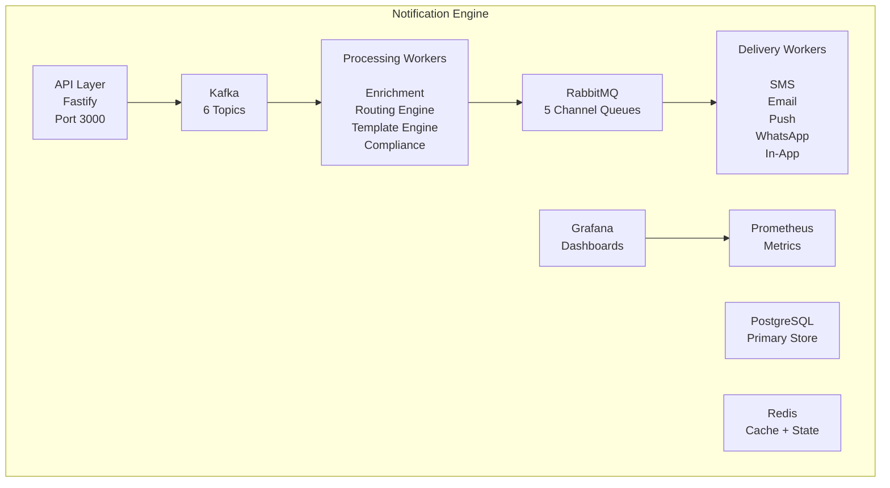

# Architecture Documentation

## System Context (C4 Level 1)



---

## Container Diagram (C4 Level 2)



---

## Notification Pipeline (Sequence)

```mermaid
sequenceDiagram

    participant Producer
    participant API
    participant Kafka
    participant Engine
    participant RabbitMQ
    participant Provider

    Producer->>API: POST /events

    API->>Kafka: publish

    API-->>Producer: 202 Accept

    Kafka->>Engine: consume

    Note over Engine:
      dedup check
      DND check
      freq cap
      quiet hours
      render template

    Engine->>RabbitMQ: publish

    RabbitMQ->>Provider: consume

    Provider->>Provider: send

    Provider-->>RabbitMQ: result

    Provider-->>Engine: DLR webhook

    Engine->>Engine: update state
```

---

## Kafka Topics

| Topic                  | Partitions | Retention | Consumer Groups | Purpose                 |
| ---------------------- | ---------- | --------- | --------------- | ----------------------- |
| notification-events    | 6          | 7 days    | standard-cg     | General events          |
| notification-critical  | 3          | 7 days    | critical-cg     | CRITICAL priority only  |
| notification-routing   | 6          | 7 days    | routing-cg      | Post-enrichment routing |
| notification-delivery  | 6          | 7 days    | delivery-cg     | Delivery status updates |
| notification-status    | 6          | 7 days    | status-cg       | State transitions       |
| notification-analytics | 6          | 30 days   | analytics-cg    | Analytics aggregation   |
| notification-dlq       | 3          | 90 days   | dlq-cg          | Dead letters            |

> Critical topic has 3 partitions (not 6). Smaller partition count means fewer rebalances during high-frequency margin call scenarios.

---

## RabbitMQ Topology

```text
Exchange: notifications (topic)

├── notifications.sms
│   └── priority=10, DLX → notifications.dlx

├── notifications.email
│   └── priority=10, DLX → notifications.dlx

├── notifications.push
│   └── priority=10, DLX → notifications.dlx

├── notifications.whatsapp
│   └── priority=10, DLX → notifications.dlx

└── notifications.in_app
    └── priority=10, DLX → notifications.dlx

Exchange: notifications.dlx (fanout)

└── notifications.*.dlq
    └── all dead letters
```

### Message Priority Mapping

| Business Priority | RabbitMQ Priority |
| ----------------- | ----------------- |
| CRITICAL (1)      | 10                |
| HIGH (2)          | 7                 |
| MEDIUM (3)        | 5                 |
| LOW (5)           | 2                 |

---

## Redis Key Structure

### Frequency Caps

```text
notif:cap:{userId}:global:daily              TTL: 86400s
notif:cap:{userId}:channel:{ch}:daily        TTL: 86400s
notif:cap:{userId}:category:{cat}:hourly     TTL: 3600s
notif:cap:{userId}:type:{type}:cooldown      TTL: 900s
```

### Deduplication

```text
notif:dedup:{sha256fingerprint}              TTL: 300s
notif:idempotency:{key}                      TTL: 86400s
```

### Circuit Breakers

```text
cb:{provider}:state                          no TTL
cb:{provider}:failures                       TTL: 60s (sliding window)
cb:{provider}:last_attempt                   no TTL
```

### Preferences

```text
user:{userId}:prefs                          TTL: 3600s
```

### DND Cache

```text
dnd:{phoneNumber}                            TTL: 86400s
```

### Retry Queue

```text
notif:retry:queue:{priority}                 no TTL
```

### Quiet Hours Queue

```text
notif:quiet:{userId}                         no TTL
```

---

## Routing Scoring Algorithm

### Formula

```text
Score =
(regulatory × 1000) +
(preference × 400) +
(deliveryRate × 300) +
(costEfficiency × 200)
```

Where:

```text
regulatory     = 1 if CRITICAL event, 0 otherwise

preference     = 1 if channel matches user preference
                 0.5 if default channel

deliveryRate   = historical delivery rate (0-1)

costEfficiency = 1 - (channelCostPaisa / maxCostPaisa)
```

### Example — RISK-001 Margin Call Routing

```text
SMS:
(1000) + (400) + (0.97 × 300) + (0.93 × 200)
= 1877

Push:
(1000) + (400) + (0.70 × 300) + (1.00 × 200)
= 1810

Email:
(1000) + (200) + (0.90 × 300) + (0.99 × 200)
= 1668
```

Both SMS and Push are selected because regulatory requirements mandate both channels.

---

## Database Schema Notes

The `notifications` table is partitioned by `created_at` (monthly).

### Key Indexes

- `(user_id, status, channel)` — user notification queries
- `(status)` WHERE IN ('QUEUED', 'RETRYING') — worker polling
- `BRIN(created_at)` — time-range analytics scans
- `(event_type, created_at)` — analytics aggregations
- `(correlation_id)` — distributed trace lookups

### Audit Trail

The `notification_state_log` table is append-only.

It is never updated and never deleted.

This serves as the immutable audit trail required by SEBI and TRAI regulations.
