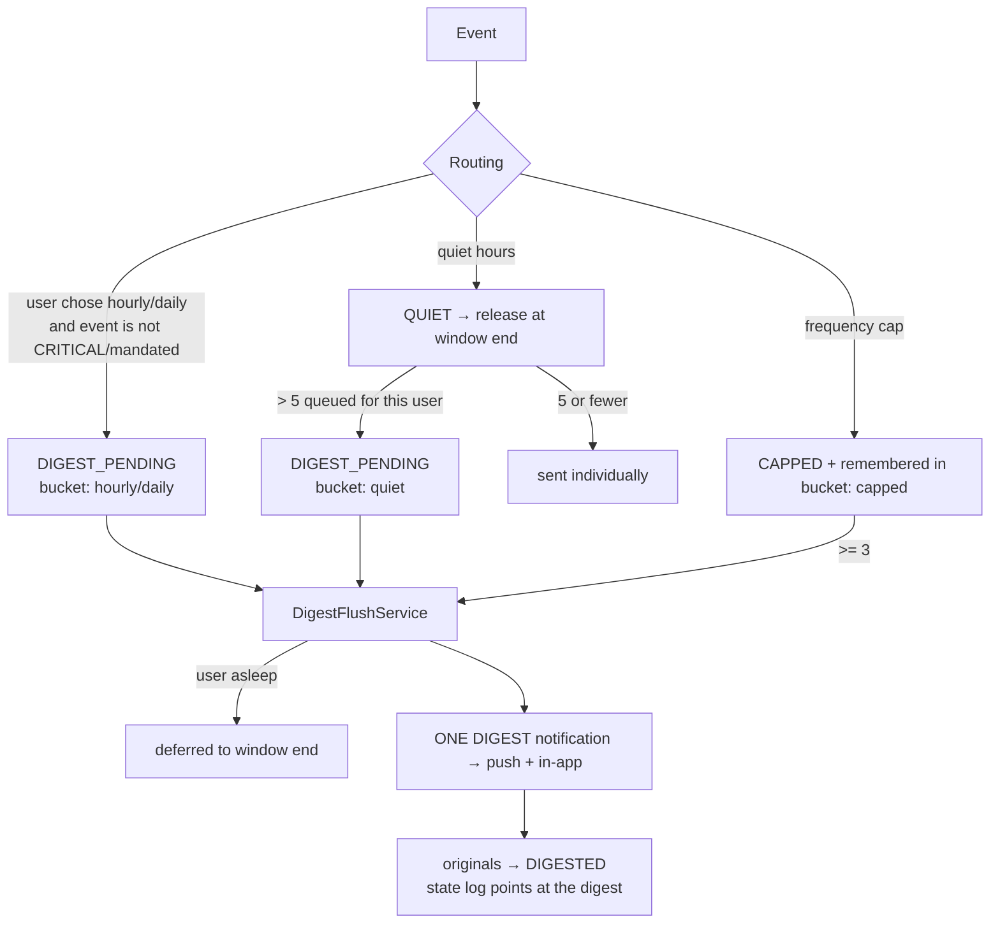

# Consent Management and Digest Aggregation

## Consent (spec A6.1, C3.3, Challenge B2.3)

### Model

`consent_records` is an **append-only** evidence log. Each row: user, channel, type, the **exact wording shown**, the **end user's
IP**, user agent, `granted`, timestamp. Withdrawing consent is a *new* row (`OPT_OUT`, `granted = false`); the most recent row for
a `(user, channel)` decides. The database enforces this — `UPDATE`, `DELETE` and `TRUNCATE` raise
`consent_records is append-only` (trigger in migration `20260922000001`), so no code path, future bug or ad-hoc SQL session can
rewrite history. Only a superuser can bypass it (the `replica` role), which is how tests purge their own rows.

| Channel | `consent_type` | Notes |
|---|---|---|
| `sms`, `email`, `push`, `in_app` | `OPT_IN` / `OPT_OUT` | |
| `whatsapp` | `WHATSAPP_OPT_IN` / `WHATSAPP_OPT_OUT` | WhatsApp Business Policy needs its **own** opt-in; a generic `OPT_IN` is rejected (422) |

### API

| Endpoint | Roles | |
|---|---|---|
| `POST /api/v1/users/:userId/consents` | SERVICE, ADMIN | body: `channel`, `consent_type`, `consent_text` (10–2000 chars), optional `ip_address` (the **end user's**; falls back to the request IP), `user_agent`. → `201 { consent_id, user_id, channel, consent_type, granted, recorded_at }` |
| `GET /api/v1/users/:userId/consents?channel=` | ADMIN, OPERATOR, SERVICE | full history, newest first, paginated |
| `GET /api/v1/users/:userId/consents/status` | ADMIN, OPERATOR, SERVICE | current state for **every** channel: `granted` / `withdrawn` / `none` |
| `GET /api/v1/compliance/audit/sms` | ADMIN, OPERATOR | every SMS in the window with its DND check timestamp/result; `summary.sent_without_dnd_check` must be **0** |
| `GET /api/v1/compliance/audit/promotional-consent` | ADMIN, OPERATOR | every promotional message with the consent record that authorised it; `consent_missing: true` = a finding |

Audit windows default to the last 90 days and may not exceed 90.

### Enforcement (at dispatch, like DND — ADR-006)

A send needs consent when it is **WhatsApp** (any message) or a **promotional SMS/email**. Transactional SMS/email (margin calls,
confirmations, OTPs) and push/in-app do not. The check runs in the delivery worker immediately before the provider call, so a
withdrawal takes effect on the very next send. A refused send ends in state **`NO_CONSENT`** (state log records `reason` and the
record it rested on); an allowed one stores the authorising record's id on the notification (`consentRecordId`), which is what the
promotional-consent audit joins on.

`CONSENT_ENFORCEMENT`:

| Mode | Behaviour |
|---|---|
| `enforce` (default) | block sends without valid consent |
| `audit` | send anyway, but log a warning and count `notification_consent_blocks_total{mode="audit"}` — **use while migrating existing users** |
| `off` | do not check |

If the consent lookup itself fails, the send is **not** made and **not** lost: it is retried, then dead-lettered (`CONSENT_CHECK_UNAVAILABLE`, transient).

### Existing users need real consent records

Nothing can fabricate consent for real users. Before switching a production system to `enforce`: run in `audit`, watch the metric,
collect real consent through `POST …/consents` (e.g. when users next open the app), then switch. For **development data only**,
`npm run seed:consent` adds clearly-labelled synthetic consent (`SYNTHETIC TEST CONSENT …`, loopback IP); it refuses to run with `NODE_ENV=production`.

### Erasure vs. consent evidence

`DELETE /api/v1/users/:userId/data` anonymises the user but **retains** consent records (`consent_records_retained` in the
response). They are legal evidence that messages were permitted, the table is append-only, and retention for a legal obligation is an
exception to erasure. Once the user row is anonymised (contact details replaced, blind indexes cleared) the retained rows no longer
identify a person.

## Digests (spec Day 5, A6.3, Appendix B)

A digest is **one new notification** (`eventType: DIGEST`, template `DIGEST-v1`) that summarises many held ones. It travels the normal
pipeline — state machine, RabbitMQ, delivery worker, retry, DLQ — on **push and in-app only** (free; no DND or consent gate).

| Source | Trigger | Delivered | Minimum |
|---|---|---|---|
| `hourly` / `daily` | the user set `digest_mode` for the category | next full hour / the user's morning (end of quiet hours) | 1 |
| `quiet` | **more than 5** notifications piled up during quiet hours (spec: "exceeds 5") | when quiet hours end | — |
| `capped` | frequency-capped notifications | the next morning | **3** (fewer stay `CAPPED`) |

**Never digested:** CRITICAL events and regulator-mandated events (`REGULATORY_MANDATORY_EVENTS`), whatever the user chose.

Flow of state for a folded notification: `ENRICHED|QUIET|CAPPED → DIGEST_PENDING → DIGESTED`.

### Guarantees

* **Nothing is lost.** If building or queueing a digest fails, every item goes back into its bucket and is retried in 5 minutes; a digest
  that itself lands in the DLQ leaves its items pending, never marked `DIGESTED`.
* **Exactly one flusher per bucket**, across replicas: due buckets are claimed with `ZREM`, items are taken with an atomic read-and-delete.
* **Quiet hours are respected**: an hourly/daily digest that comes due while the user is asleep is deferred to the window's end.
* **Consistent overnight decision**: the "more than 5" test uses a snapshot of the user's queue taken *before* the batch is released.
* Each line is rendered in the **user's language and currency**; at most 5 lines are shown, with `+N` for the rest.
* Metrics: `notification_digests_sent_total{source}`, `notification_digest_items_total{source}`.

### Known limitations

* Digest text for pcm/ha/yo/ig is a draft awaiting native-speaker review; other languages fall back to English.
* A capped bucket below the threshold is discarded rather than carried to the next day.
* The weekly "you receive a lot — consider a digest" suggestion (A6.2) is not implemented.
