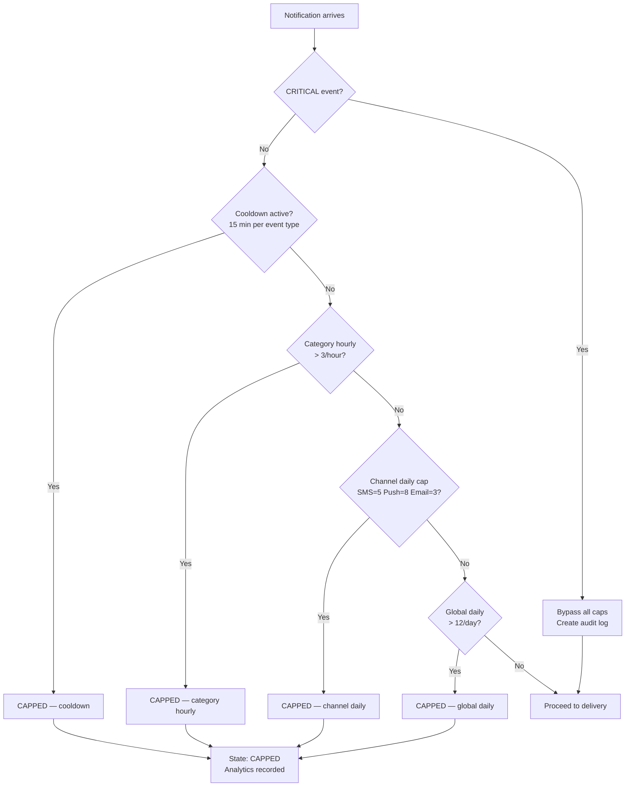

<!-- docs/sequence-diagrams/frequency-cap-flow.md -->

# Frequency Cap Flow

## Cap Evaluation Order

## Implementation Note

Caps are evaluated most-specific first. This differs from the spec (Section A6.2) which lists global daily first — see Deliberate Error #4 in `docs/deliberate-error-log.md` for the full analysis of why the spec's ordering is mathematically inconsistent.
