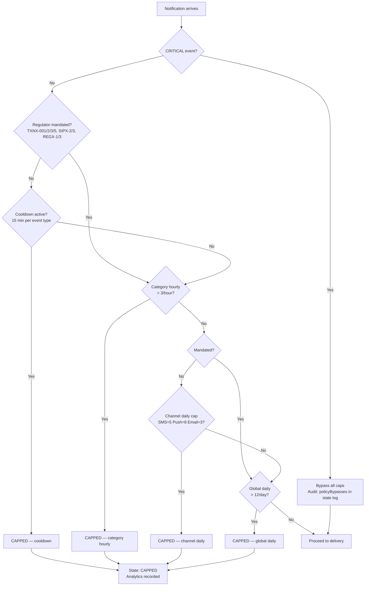

<!-- docs/sequence-diagrams/frequency-cap-flow.md -->

# Frequency Cap Flow

## Cap Evaluation Order

## Implementation Note

Caps are evaluated most-specific first. This differs from the spec (Section A6.2) which lists global daily first — see Deliberate Error #4 in `docs/deliberate-error-log.md` for the full analysis of why the spec's ordering is mathematically inconsistent.

## Regulator-mandated events

Only CRITICAL events bypass every cap. Regulator-mandated events (trade confirmations, deposits, SIP outcomes, KYC,
contract notes — `REGULATORY_MANDATORY_EVENTS`) skip the **same-type cooldown** and the **per-channel daily cap**, per spec A6.2
("Regulatory mandates bypass" the per-channel cap; the cooldown exists to damp repeat *price alerts*). They still count against
the category-hourly and global-daily caps. Without this, a second buy confirmation or deposit alert within 15 minutes was
silently `CAPPED` — an omission of a mandated notification.

## Counting: one event is one notification

A single event fans out to several channels but is **one** notification to the user. `FrequencyCapService.record()` advances the
global-daily, category-hourly and cooldown counters once per event (`countEvent = true`, first channel only); every channel advances its
own per-channel counter. Counting per channel row made one five-channel event consume a "3 per category per hour" allowance by itself.

## Race: a CRITICAL event arrives while a non-critical event is being cap-evaluated (spec Appendix B)

**What happens:** nothing needs to be coordinated, by design.

1. **CRITICAL events never read the cap counters.** `check()` returns immediately for `CRITICAL_EVENTS`; there is no lock, queue or wait
   shared with any in-flight non-critical evaluation, so a CRITICAL event cannot be delayed or blocked by one.
2. **They are not even in the same pipeline.** CRITICAL events arrive on the dedicated `notification-critical` topic, consumed by a
   separate consumer group (`notification-critical-cg`), and queue on RabbitMQ priority 10. A non-critical evaluation cannot
   sit in front of them.
3. **The critical send still spends budget.** After it is queued, `record()` advances the counters, so later non-critical events see it —
   the desired behaviour (a user who just got a margin call has less appetite for market chatter).
4. **The bypass is auditable.** The routing decision carries `policyBypasses: ['frequency_cap','quiet_hours']`, written into the
   `ENRICHED` state-log entry (`metadata.policyBypasses`).

**The trade-off we accept:** `check()` and `record()` are separate Redis operations, so two non-critical events evaluated concurrently
can both pass a cap that only had room for one. The overshoot is bounded by the number of concurrent in-flight evaluations for the
same user (Kafka keys events by `userId`, so one user's events are processed in order by a single consumer — in practice the window
is one event). Caps are therefore *soft* by at most a small constant, never unbounded. If a hard guarantee is ever required, replace
check-then-record with a single Lua script (`INCR`, compare, `DECR` on overshoot) — the counters and keys are already suited to it.

