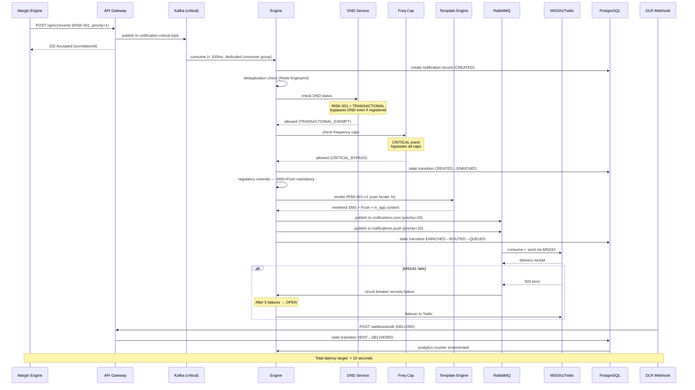

<!-- docs/sequence-diagrams/margin-call-flow.md -->

# Margin Call Notification Flow

## Sequence Diagram

## Key Design Decisions

**Why dedicated Kafka consumer group for CRITICAL events?**
The `notification-critical` topic uses a dedicated consumer group (`notification-critical-cg`) with dedicated instances. This means margin calls are never queued behind price alerts. This directly addresses the Robinhood failure mode (Case Study C4) where priority inversion caused margin calls to be delayed behind market updates.

**Why DND bypass for RISK-001?**
RISK-001 is classified as TRANSACTIONAL (SEBI mandate). TRAI DND regulations exempt transactional messages. The bypass is logged in the audit trail for compliance review.

**Why SMS + Push simultaneously (not sequentially)?**
The Saga pattern for RISK-001 uses parallel delivery, not sequential fallback. Both channels are dispatched simultaneously. If SMS fails, it retries independently without waiting for Push to complete. This ensures the user receives the notification on at least one channel within the 10-second window.
