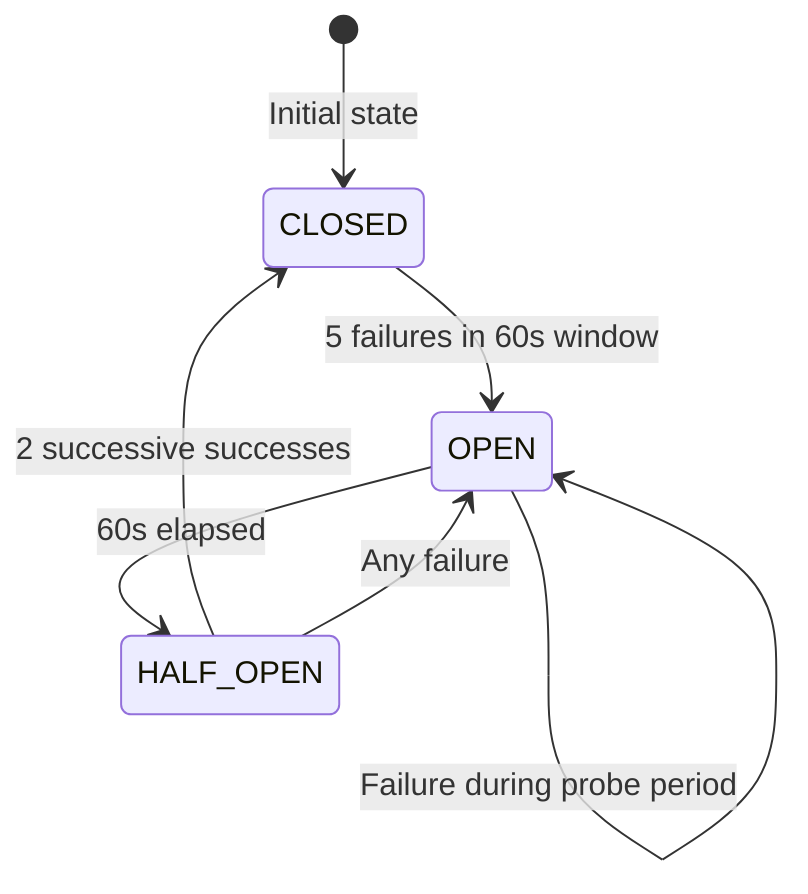
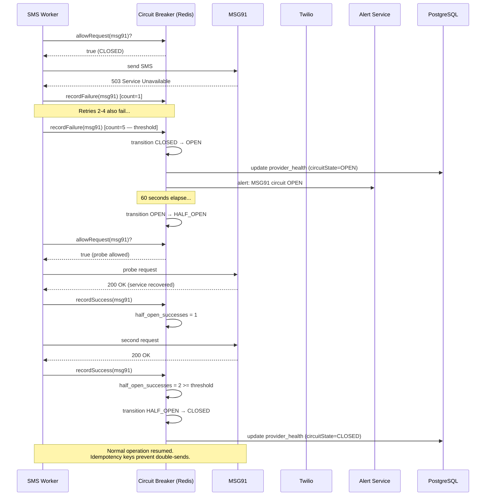

<!-- docs/sequence-diagrams/provider-failover.md -->

# Provider Failover Sequence

## Circuit Breaker State Machine

```mermaid
stateDiagram-v2
    [*] --> CLOSED: Initial state
    CLOSED --> OPEN: 5 failures in 60s window
    OPEN --> HALF_OPEN: 60s elapsed
    HALF_OPEN --> CLOSED: 2 successive successes
    HALF_OPEN --> OPEN: Any failure
    OPEN --> OPEN: Failure during probe period
```

## MSG91 Outage Failover Sequence

```mermaid
sequenceDiagram
    participant W as SMS Worker
    participant CB as Circuit Breaker (Redis)
    participant M as MSG91
    participant T as Twilio
    participant OPS as Alert Service
    participant DB as PostgreSQL

    W->>CB: allowRequest(msg91)?
    CB-->>W: true (CLOSED)
    W->>M: send SMS
    M-->>W: 503 Service Unavailable
    W->>CB: recordFailure(msg91) [count=1]

    Note over W,CB: Retries 2-4 also fail...

    W->>CB: recordFailure(msg91) [count=5 — threshold]
    CB->>CB: transition CLOSED → OPEN
    CB->>DB: update provider_health (circuitState=OPEN)
    CB->>OPS: alert: MSG91 circuit OPEN

    Note over CB: 60 seconds elapse...

    CB->>CB: transition OPEN → HALF_OPEN

    W->>CB: allowRequest(msg91)?
    CB-->>W: true (probe allowed)
    W->>M: probe request
    M-->>W: 200 OK (service recovered)
    W->>CB: recordSuccess(msg91)
    CB->>CB: half_open_successes = 1

    W->>M: second request
    M-->>W: 200 OK
    W->>CB: recordSuccess(msg91)
    CB->>CB: half_open_successes = 2 >= threshold
    CB->>CB: transition HALF_OPEN → CLOSED
    CB->>DB: update provider_health (circuitState=CLOSED)

    Note over W,M: Normal operation resumed.<br/>Idempotency keys prevent double-sends.
```
